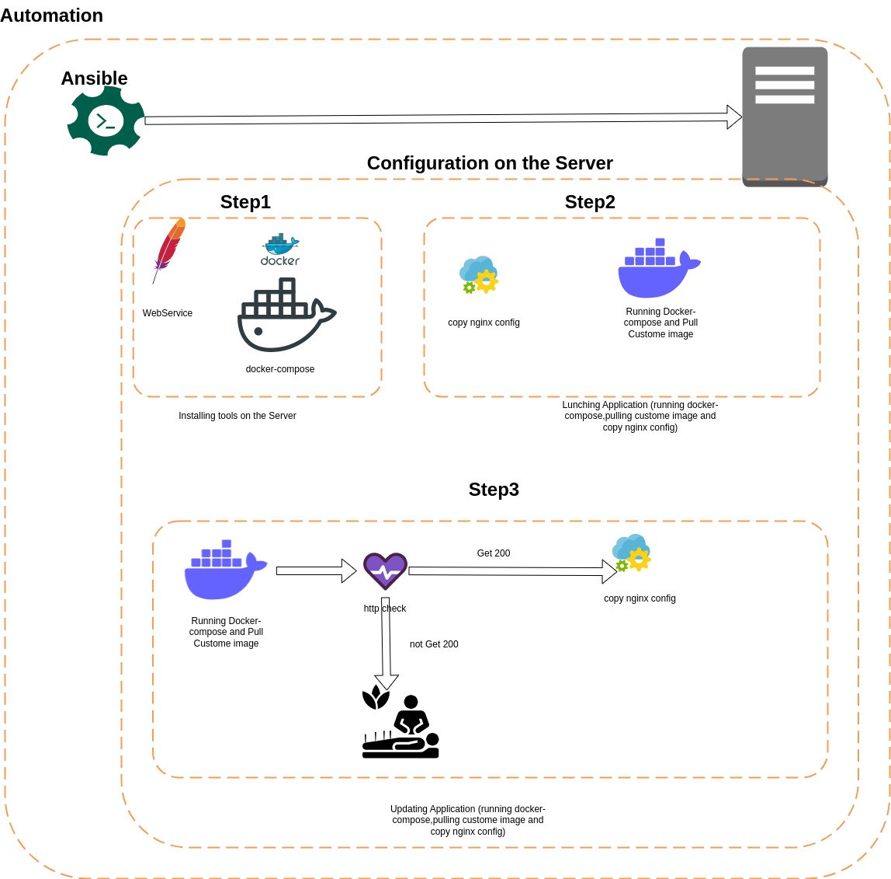
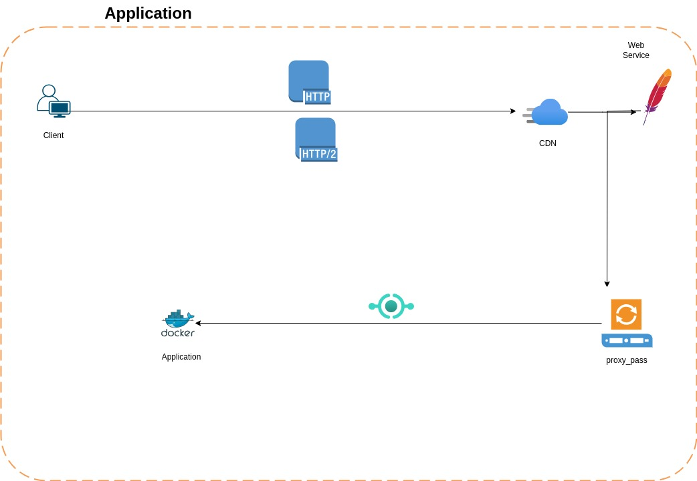

# weather Application

This project helps you to see the weather condition of Istanbul city


## diagram





## Features

- FastAPI framework for high performance
- Docker integration for easy deployment
- (Add other features specific to your application)

## Getting Started

These instructions will get you a copy of the project up and running on your local machine for development and testing purposes.

### Prerequisites

What things you need to install the software and how to install them:

- Docker
- (Any other prerequisites)

### Requirements for deploying this application

* pre configure

```bash
   # Generate SSH key
   ssh-keygen
   # Copy SSH key to servers
   ssh-copy-id your serverip
```
* you must install Ansible on your deploy or your client

```bash
sudo apt update
sudo apt install software-properties-common
sudo add-apt-repository --yes --update ppa:ansible/ansible
sudo apt install ansible
```

### Installing

A step-by-step series of examples that tell you how to get a development environment running:

1. Clone the repository:
   ```bash
   git clone https://github.com/rezabojnordi/api_code.git


* Note:

before running Ansible you must change the default variable based on your infrastructure

```bash
vim roles/blue_green/defaults/main.yml

---
# defaults file for blue_green

nginx_listener: "80"

####### Docker config ########
docker_compose_version: "v2.23.1"
old_app_version: "v1.0"
old_app_port: "8081"

docker_image: "rezabojnordi/fastapi-app"

new_app_version: "v1.0"
new_app_port: "8082"

```


#### Pre-installation Tasks
Before updating the web application, you may need to perform pre-installation tasks such as installing dependencies, configuring the environment, or any other necessary setup. Use the following Ansible command to execute the pre-installation tasks:

``` bash
ansible-playbook -i inventory --tag preinstall run.yaml

```
#### Launching the Application
After completing the pre-installation tasks, use the following Ansible command to launch the web application:

``` bash
ansible-playbook -i inventory --tag lunch run.yaml

```
This command will handle the necessary steps to launch the web application, including starting required services and configuring the environment.

#### Performing Updates

To update the web application to the latest version, use the following Ansible command:

```bash

ansible-playbook -i inventory --tag update run.yaml

```

#### Tunning Operating System and hardening

``` bash
ansible-playbook -i inventory --tag tune run.yaml
```
This command will execute the necessary tasks to update the application, ensuring that the latest changes are applied.

* Note: 

Make sure to replace inventory with the path to your Ansible inventory file.

```
vim inventory

[all]
your_address_ip ansible_user=root

```
Feel free to customize the playbook files (run.yaml and associated tasks) based on your specific application requirements and update process.

For any issues or questions, refer to the documentation or contact the system administrator.

### Docs
if you want to know how to use Api plsease open below Url on your browser

```
http://{ServerAddress}/docs
```
